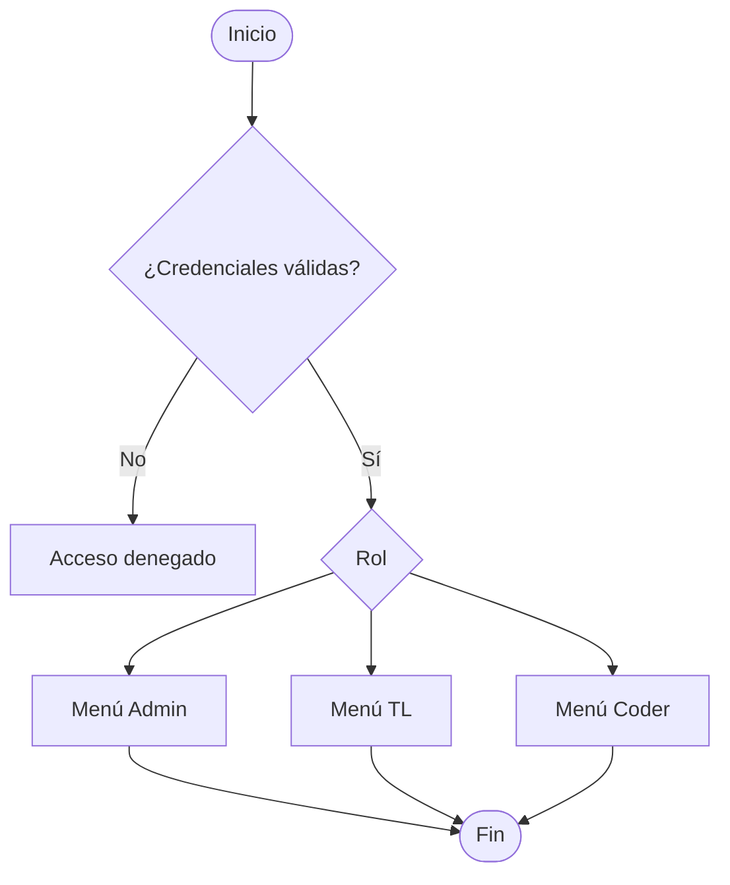
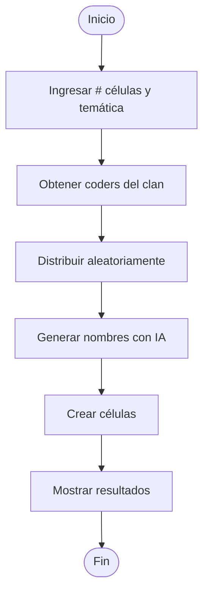
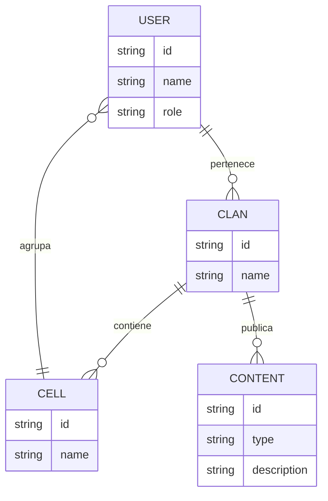

# 📄 Especificación de Requisitos de Software (SRS)

**Proyecto:** Sistema de Gestión de Clanes (Java Consola)  
**Versión:** 1.0.0  
**Estado:** Documento Base  
**Estándar:** ISO 29148 / IEEE 830

---

## 1. Introducción

### 1.1 Propósito

El propósito de este documento es definir los requisitos funcionales y no funcionales del sistema **Sistema de Gestión de Clanes**, el cual permitirá administrar clanes, usuarios y su organización interna de manera eficiente mediante una aplicación de consola en Java.

Este documento servirá como guía para el desarrollo, validación y mantenimiento del sistema.

### 1.2 Alcance del Sistema

El sistema permitirá:

- Gestionar usuarios con roles diferenciados (Admin, TL y Coder)
- Administrar clanes y sus integrantes
- Automatizar la organización de equipos de trabajo (células)
- Centralizar la comunicación entre TLs y coders
- Integrar generación de nombres inteligentes mediante IA

> El sistema será ejecutado en consola, sin interfaz gráfica.

---

## 2. Descripción General

### 2.1 Perspectiva del Producto

El sistema es una aplicación independiente basada en consola desarrollada en Java.

Interactúa con:

- Archivos CSV (para carga masiva)
- Servicios externos de IA (para generación de nombres)

### 2.2 Funciones del Producto

- **Autenticación:** Inicio de sesión por roles
- **Gestión de Clanes:** CRUD completo
- **Gestión de Usuarios:** CRUD de Admins, TLs y Coders
- **Asignaciones:** Relación entre usuarios y clanes
- **Automatización:**
  - Carga masiva de coders
  - Eliminación masiva
- **Organización:** Creación automática de células
- **Comunicación:** Publicación de contenido por TLs

### 2.3 Características de Usuarios

| Usuario | Descripción |
|--------|-------------|
| Admin | Control total del sistema |
| TL (Team Leader) | Gestiona clanes y equipos |
| Coder | Accede a contenido de su clan |

### 2.4 Restricciones

- Aplicación solo en consola
- Un coder solo puede pertenecer a un clan
- Un TL puede pertenecer a múltiples clanes
- Máximo por clan:
  - 1 TL de programación
  - 2 TLs de inglés

---

## 3. Requisitos Específicos

### 3.1 Requisitos Funcionales (RF)

| ID | Nombre | Descripción | Prioridad |
|----|--------|-------------|-----------|
| RF-01 | Autenticación | El sistema DEBE permitir inicio de sesión con roles (Admin, TL, Coder). | Alta |
| RF-02 | CRUD Clanes | El sistema DEBE permitir crear, consultar, actualizar y eliminar clanes. | Alta |
| RF-03 | CRUD Usuarios | El sistema DEBE permitir gestionar Admins, TLs y Coders. | Alta |
| RF-04 | Asignación TL | El sistema DEBE permitir asignar TLs a clanes. | Alta |
| RF-05 | Asignación Coders | El sistema DEBE permitir asignar coders a clanes. | Alta |
| RF-06 | Carga Masiva | El sistema DEBE permitir cargar coders desde archivo CSV. | Alta |
| RF-07 | Eliminación Masiva | El sistema DEBE permitir eliminar coders por clan. | Media |
| RF-08 | Visualización TL | El TL DEBE visualizar coders de sus clanes. | Alta |
| RF-09 | Publicación Contenido | El TL DEBE publicar archivos, links y comunicados. | Alta |
| RF-10 | Visualización Coder | El coder DEBE ver contenido de su clan. | Alta |
| RF-11 | Creación de Células | El sistema DEBE distribuir coders automáticamente en células. | Alta |
| RF-12 | Generación IA | El sistema DEBE generar nombres de células usando IA según temática. | Alta |

### 3.2 Requisitos No Funcionales (RNF)

| ID | Atributo | Requisito de Calidad |
|----|----------|----------------------|
| RNF-01 | Rendimiento | La creación de células debe tardar menos de 10 segundos. |
| RNF-02 | Eficiencia | La carga masiva debe reducir el tiempo en al menos 70%. |
| RNF-03 | Usabilidad | El flujo en consola debe ser claro y en máximo 3 pasos para tareas clave. |
| RNF-04 | Seguridad | El sistema debe restringir acceso según rol sin fugas de información. |
| RNF-05 | Consistencia | La distribución de células debe ser equilibrada (±1 miembro). |

---

## 4. Modelado Lógico (Diagramas Mermaid)

### 4.1 Flujo de Autenticación

### 4.2 Creación de Células

### 4.3 Modelo de Datos (ER Diagram)

---

## 5. Matriz de Trazabilidad de Requisitos (RTM)

| ID Req | Módulo (Implementación) | Caso de Prueba | Estado |
|--------|------------------------|----------------|--------|
| RF-01 | AuthService.java | Login válido/inválido | ⏳ |
| RF-06 | CsvLoader.java | Carga masiva correcta | ⏳ |
| RF-11 | CellService.java | Distribución equilibrada | ⏳ |
| RF-12 | AIService.java | Generación de nombres | ⏳ |

---

## 6. Indicadores de Éxito (KPIs)

### Eficiencia Operativa
- Reducción ≥ 70% en carga de coders
- Creación de células < 10 segundos

### Automatización
- 100% coders asignados automáticamente
- 100% nombres generados por IA

### Gestión
- Diferencia máxima de 1 coder por célula
- 0 errores en asignaciones

### Uso del Sistema
- ≥ 80% funcionalidades usadas por rol
- Sin fugas de información

### Experiencia de Usuario
- Flujo simple (≤ 3 pasos)
- Fácil uso en consola

---

## 7. Gestión de Cambios

| Versión | Fecha | Autor | Descripción |
|---------|-------|-------|-------------|
| 1.0.0 | 2026-03-27 | Juan Esteban | Creación inicial del SRS |

---

## 8. Glosario

| Término | Definición |
|---------|-----------|
| **TL** | Team Leader |
| **Coder** | Desarrollador miembro del clan |
| **Célula** | Equipo de trabajo dentro de un clan |
| **CRUD** | Crear, Leer, Actualizar, Eliminar |
| **IA** | Inteligencia Artificial |
